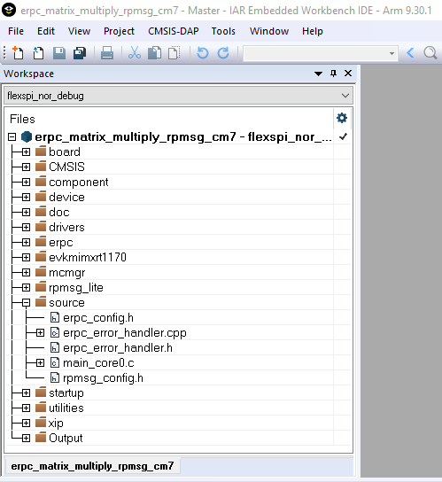

# Client user code

The client’s user code is stored in the main\_core0.c file, located in the following folder:

*<MCUXpressoSDK\_install\_dir\>/boards/evkmimxrt1170/multicore\_example/erpc\_matrix\_multiply\_rpmsg/cm7*

The `main_core0.c` file contains the code for target board and eRPC initialization.

-   After initialization, the secondary core is released from reset.
-   When the secondary core is ready, the primary core initializes two matrix variables.
-   The erpcMatrixMultiply eRPC function is called to issue the eRPC request and get the result.

It is possible to write the application-specific eRPC error handler. The eRPC error handler of the matrix multiply application is implemented in `erpc_error_handler.h` and `erpc_error_handler.cpp` files.

The matrix multiplication can be issued repeatedly, when pressing a software board button.

The eRPC-relevant code is captured in the following code snippet:

```
...
extern bool g_erpc_error_occurred;
...
/* Declare matrix arrays */
Matrix matrix1 = {0}, matrix2 = {0}, result_matrix = {0};
...
/* RPMsg-Lite transport layer initialization */
erpc_transport_t transport;
transport = erpc_transport_rpmsg_lite_master_init(src, dst,
ERPC_TRANSPORT_RPMSG_LITE_LINK_ID);
...
/* MessageBufferFactory initialization */
erpc_mbf_t message_buffer_factory;
message_buffer_factory = erpc_mbf_rpmsg_init(transport);
...
/* eRPC client side initialization */
erpc_client_t client;
client = erpc_client_init(transport, message_buffer_factory);
...
/* Set default error handler */
erpc_client_set_error_handler(client, erpc_error_handler);
...
while (1)
{
  /* Invoke the erpcMatrixMultiply function */
  erpcMatrixMultiply(matrix1, matrix2, result_matrix);
  ...
  /* Check if some error occured in eRPC */
  if (g_erpc_error_occurred)
  {
    /* Exit program loop */
    break;
  }
  ...
}
```

Except for the application main file, there are configuration files for the RPMsg-Lite \(`rpmsg_config.h`\) and eRPC \(`erpc_config.h`\), located in the following folder:

*<MCUXpressoSDK\_install\_dir\>/boards/evkmimxrt1170/multicore\_examples/erpc\_matrix\_multiply\_rpmsg*

|

|

**Parent topic:**[Multicore client application](../topics/multicore_client_application.md)

