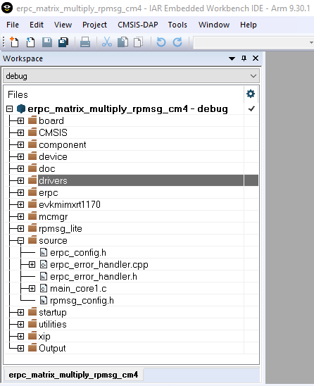

# Server user code

The server’s user code is stored in the `main_core1.c` file, located in the following folder:

*<MCUXpressoSDK\_install\_dir\>/boards/evkmimxrt1170/multicore\_examples/erpc\_matrix\_multiply\_rpmsg/cm4*

The `main_core1.c` file contains two functions:

-   The **main\(\)** function contains the code for the target board and eRPC server initialization. After the initialization, the matrix multiply service is added and the eRPC server waits for client’s requests in the while loop.
-   The **erpcMatrixMultiply\(\)** function is the user implementation of the eRPC function defined in the IDL file.
-   There is the possibility to write the application-specific eRPC error handler. The eRPC error handler of the matrix multiply application is implemented in the `erpc_error_handler.h` and `erpc_error_handler.cpp` files.

The eRPC-relevant code is captured in the following code snippet:

```
/* erpcMatrixMultiply function user implementation */
void erpcMatrixMultiply(const Matrix *matrix1, const Matrix *matrix2, Matrix *result_matrix)
{
  ...
}
int main()
{
  ...
  /* RPMsg-Lite transport layer initialization */
  erpc_transport_t transport;
  transport = erpc_transport_rpmsg_lite_remote_init(src, dst, (void*)startupData,
  ERPC_TRANSPORT_RPMSG_LITE_LINK_ID, SignalReady, NULL);
  ...
  /* MessageBufferFactory initialization */
  erpc_mbf_t message_buffer_factory;
  message_buffer_factory = erpc_mbf_rpmsg_init(transport);
  ...
  /* eRPC server side initialization */
  erpc_server_t server;
  server = erpc_server_init(transport, message_buffer_factory);
  ...
  /* Adding the service to the server */
  erpc_service_t service = create_MatrixMultiplyService_service();
  erpc_add_service_to_server(server, service);
  ...
  while (1)
  {
    /* Process eRPC requests */
    erpc_status_t status = erpc_server_poll(server);
    /* handle error status */
    if (status != kErpcStatus_Success)
    {
      /* print error description */
      erpc_error_handler(status, 0);
      ...
    }
    ...
  }
}
```

Except for the application main file, there are configuration files for the RPMsg-Lite \(`rpmsg_config.h`\) and eRPC \(`erpc_config.h`\), located in the *<MCUXpressoSDK\_install\_dir\>/boards/evkmimxrt1170/multicore\_examples/ erpc\_matrix\_multiply\_rpmsg* folder.

|

|

**Parent topic:**[Multicore server application](../topics/multicore_server_application.md)

