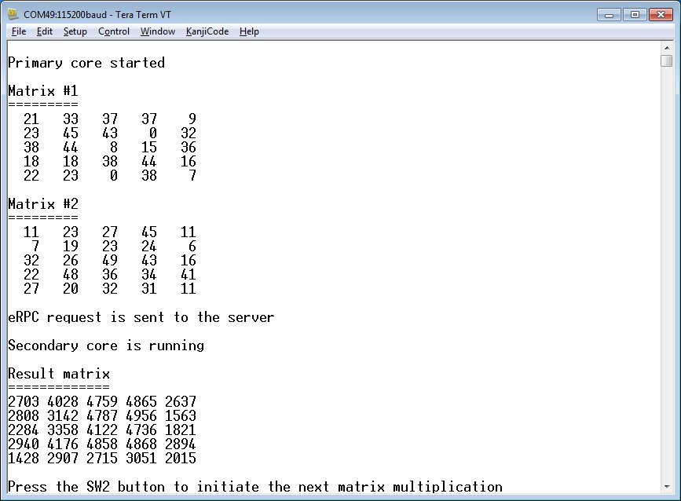

# Running the eRPC application

Follow the instructions in *Getting Started with MCUXpresso SDK* \(document MCUXSDKGSUG\) \(located in the *<MCUXpressoSDK\_install\_dir\>/docs* folder\), to load both the primary and the secondary core images into the on-chip memory, and then effectively debug the dual-core application. After the application is running, the serial console should look like:

|

|

For multiprocessor applications that are running between PC and the target evaluation board or between two boards, follow the instructions in the accompanied example readme files that provide details about the proper board setup and the PC side setup \(Python\).

**Parent topic:**[Create an eRPC application](../topics/create_an_erpc_application.md)

