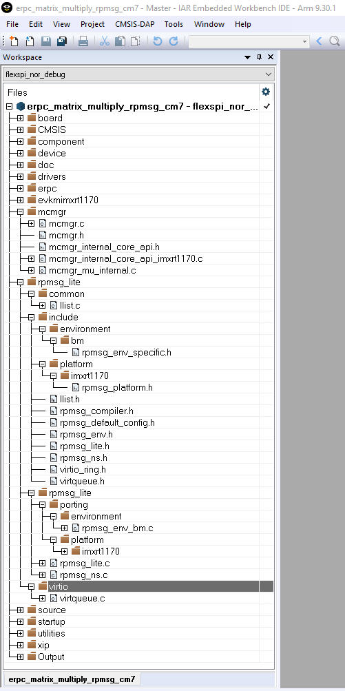

# Client multicore infrastructure files

Because of the RPMsg-Lite \(transport layer\), it is also necessary to include RPMsg-Lite related files, which are in the following folder:

*<MCUXpressoSDK\_install\_dir\>/middleware/multicore/rpmsg\_lite/*

The multicore example applications also use the Multicore Manager software library to control the secondary core startup and shutdown. These source files are located in the following folder:

*<MCUXpressoSDK\_install\_dir\>/middleware/multicore/mcmgr/*

|

|

**Parent topic:**[Multicore client application](../topics/multicore_client_application.md)

