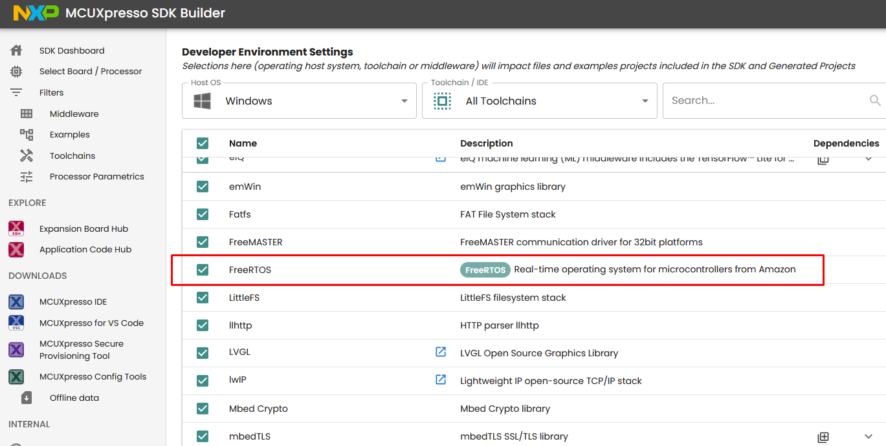
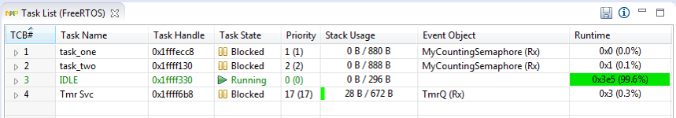

# FreeRTOS kernel for MCUXpresso SDK
## Overview

The purpose of this document is to describes the [FreeRTOS kernel repo](https://github.com/FreeRTOS/FreeRTOS) integration into the [NXP MCUXpresso Software Development Kit: mcuxsdk](https://github.com/nxp-mcuxpresso/mcuxsdk-manifests).
MCUXpresso SDK provides a comprehensive development solutions designed to optimize, ease, and help accelerate embedded system development of applications based on MCUs from NXP. This project involves the FreeRTOS kernel repo fork with:
- cmake and Kconfig support to allow the configuration and build in MCUXpresso SDK ecosystem
- FreeRTOS OS additions, such as [FreeRTOS driver wrappers](https://github.com/nxp-mcuxpresso/mcux-freertos-drivers), RTOS ready FatFs file system, and the implementation of FreeRTOS tickless mode

The history of changes in FreeRTOS kernel repo for MCUXpresso SDK are summarized in [CHANGELOG_mcuxsdk.md](CHANGELOG_mcuxsdk.md) file.

The MCUXpresso SDK framework also contains a set of FreeRTOS examples which show basic FreeRTOS OS features. This makes it easy to start a new FreeRTOS project or begin experimenting with FreeRTOS OS. Selected drivers and middleware are RTOS ready with related FreeRTOS adaptation layer.
 
## FreeRTOS example applications

The FreeRTOS examples are written to demonstrate basic FreeRTOS features and the interaction between peripheral drivers and the RTOS. 

### List of examples

The list of freertos_examples, their description and availability for individual supported MCUXpresso SDK development boards can be obtained here:
[https://mcuxpresso.nxp.com/mcuxsdk/latest/html/examples/freertos_examples/index.html](https://mcuxpresso.nxp.com/mcuxsdk/latest/html/examples/freertos_examples/index.html)

### Location of examples

The FreeRTOS examples are located in [mcuxsdk-examples](https://github.com/nxp-mcuxpresso/mcuxsdk-examples) repository, see the freertos_examples folder.

Once using MCUXpresso SDK zip packages created via the [MCUXpresso SDK Builder](https://mcuxpresso.nxp.com) the FreeRTOS kernel library and associated freertos_examples are added into final zip package once FreeRTOS components is selected on the Developer Environment Settings page:



The FreeRTOS examples in MCUXpresso SDK zip packages are located in <MCUXpressoSDK\_install\_dir\>/boards/<board\_name\>/freertos\_examples/ subfolders.

### Building a FreeRTOS example application

For information how to use the cmake and Kconfig based build and configuration system and how to build freertos_examples visit:<p>
[MCUXpresso SDK documentation for Build And Configuration](https://mcuxpresso.nxp.com/mcuxsdk/latest/html/develop/build_system/index.html)<p>
[MCUXpresso SDK Getting Start Guide](https://mcuxpresso.nxp.com/mcuxsdk/latest/html/gsd/repo.html#gsd-index)<p>

Tip: To list all FreeRTOS example projects and targets that can be built via the west build command, use this west list_project command in mcuxsdk workspace:

```bash
west list_project -p examples/freertos_examples
```


### FreeRTOS aware debugger plugin

NXP provides FreeRTOS task aware debugger for GDB. The plugin is compatible with Eclipse-based \(MCUXpressoIDE\) and is available after the installation.



 
