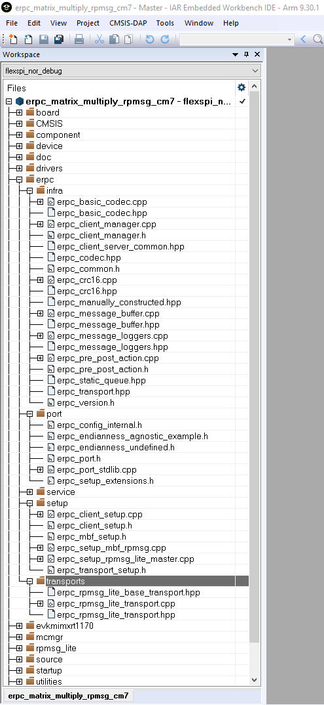

# Client infrastructure files

The eRPC infrastructure files are located in the following folder:

*<MCUXpressoSDK\_install\_dir\>/middleware/multicore/erpc/erpc\_c*

The **erpc\_c** folder contains files for creating eRPC client and server applications in the C/C++ language. These files are distributed into subfolders.

-   The **infra** subfolder contains C++ infrastructure code used to build server and client applications.
-   Two files, `erpc_client_manager.h` and `erpc_client_manager.cpp`, are used for managing the client-side application. The main purpose of the client files is to create, perform, and release eRPC requests.
-   Three files \(`erpc_codec.hpp`, `erpc_basic_codec.hpp`, and `erpc_basic_codec.cpp`\) are used for codecs. Currently, the basic codec is the initial and only implementation of the codecs.
-   `erpc_common.h` file is used for common eRPC definitions, typedefs, and enums.
-   `erpc_manually_constructed.hpp` file is used for allocating static storage for the used objects.
-   Message buffer files are used for storing serialized data: `erpc_message_buffer.hpp` and `erpc_message_buffer.cpp`.
-   `erpc_transport.hpp` file defines the abstract interface for transport layer.

The **port** subfolder contains the eRPC porting layer to adapt to different environments.

-   `erpc_port.h` file contains definition of erpc\_malloc\(\) and erpc\_free\(\) functions.
-   `erpc_port_stdlib.cpp` file ensures adaptation to stdlib.
-   `erpc_config_internal.h` internal eRPC configuration file.

The **setup** subfolder contains a set of plain C APIs that wrap the C++ infrastructure, providing client and server init and deinit routines that greatly simplify eRPC usage in C-based projects. No knowledge of C++ is required to use these APIs.

-   `erpc_client_setup.h` and `erpc_client_setup.cpp` files needs to be added into the “Matrix multiply” example project to demonstrate the use of C-wrapped functions in this example.
-   `erpc_transport_setup.h` and `erpc_setup_rpmsg_lite_master.cpp` files needs to be added into the project in order to allow C-wrapped function for transport layer setup.
-   `erpc_mbf_setup.h` and `erpc_setup_mbf_rpmsg.cpp` files needs to be added into the project in order to allow message buffer factory usage.

The **transports** subfolder contains transport classes for the different methods of communication supported by eRPC. Some transports are applicable only to host PCs, while others are applicable only to embedded or multicore systems. Most transports have corresponding client and server setup functions, in the setup folder.

-   RPMsg-Lite is used as the transport layer for the communication between cores, `erpc_rpmsg_lite_base_transport.hpp`, `erpc_rpmsg_lite_transport.hpp`, and `erpc_rpmsg_lite_transport.cpp` files needs to be added into the client project.

|

|

**Parent topic:**[Multicore client application](../topics/multicore_client_application.md)

