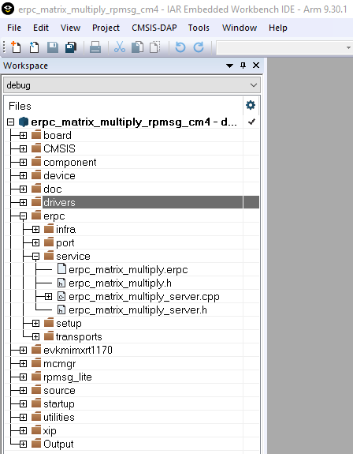

# Server related generated files

The server-related generated files are:

-   `erpc_matric_multiply.h`
-   `erpc_matrix_multiply_server.h`
-   `erpc_matrix_multiply_server.cpp`

The server-related generated files contain the shim code for functions and data types declared in the IDL file. These files also contain functions for the identification of client requested functions, data deserialization, calling requested function’s implementations, and data serialization and return, if requested by the client. These shim code files can be found in the following folder:

*<MCUXpressoSDK\_install\_dir\>/boards/evkmimxrt1170/multicore\_examples/erpc\_common/erpc\_matrix\_multiply/service/*

|

|

**Parent topic:**[Multicore server application](../topics/multicore_server_application.md)

