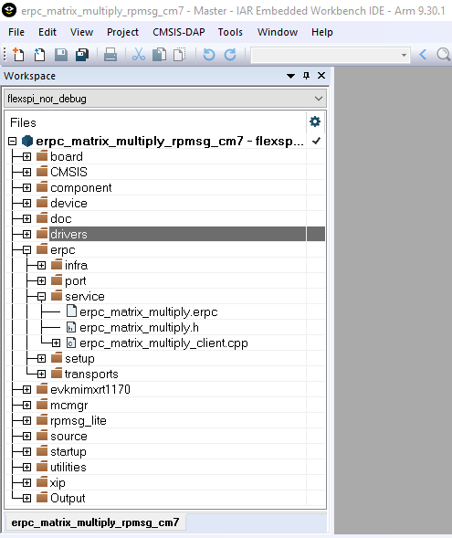

# Client-related generated files

The client-related generated files are:

-   `erpc_matric_multiply.h`
-   `erpc_matrix_multiply_client.cpp`

These files contain the shim code for the functions and data types declared in the IDL file. These functions also call methods for codec initialization, data serialization, performing eRPC requests, and de-serializing outputs into expected data structures \(if return values are expected\). These shim code files can be found in the *<MCUXpressoSDK\_install\_dir\>/boards/evkmimxrt1170/multicore\_examples/erpc\_common/erpc\_matrix\_multiply/service/* folder.

|

|

**Parent topic:**[Multicore client application](../topics/multicore_client_application.md)

