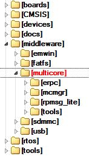

# Getting Started with Multicore SDK (MCSDK)

## Overview

Multicore Software Development Kit (MCSDK) is a Software Development Kit that provides comprehensive software support for NXP dual/multicore devices. The MCSDK is combined with the MCUXpresso SDK to make the software framework for easy development of multicore applications.

The following figure highlights the layers and main software components of the MCSDK.

All the MCSDK-related files are located in _`<MCUXpressoSDK_install_dir>/middleware/multicore`_ folder.

For supported toolchain versions, see the _Multicore SDK v25.06.00 Release Notes_ `(document MCSDKRN)`. For the latest version of this and other MCSDK documents, visit [www.nxp.com](http://www.nxp.com).

## Multicore SDK (MCSDK) components

The MCSDK consists of the following software components:

- **Embedded Remote Procedure Call (eRPC):** This component is a combination of a library and code generator tool that implements a transparent function call interface to remote services (running on a different core).
- **Multicore Manager (MCMGR):** This library maintains information about all cores and starts up secondary/auxiliary cores.
- **Remote Processor Messaging - Lite (RPMsg-Lite):** Inter-Processor Communication library.

## Embedded Remote Procedure Call (eRPC)

The Embedded Remote Procedure Call (eRPC) is the RPC system created by NXP. The RPC is a mechanism used to invoke a software routine on a remote system via a simple local function call.

When a remote function is called by the client, the function's parameters and an identifier for the called routine are marshaled (or serialized) into a stream of bytes. This byte stream is transported to the server through a communications channel (IPC, TPC/IP, UART, and so on). The server unmarshaled the parameters, determines which function was invoked, and calls it. If the function returns a value, it is marshaled and sent back to the client.

RPC implementations typically use a combination of a tool (erpcgen) and IDL (interface definition language) file to generate source code to handle the details of marshaling a function's parameters and building the data stream.

**Main eRPC features:**

- Scalable from BareMetal to Linux OS - configurable memory and threading policies.
- Focus on embedded systems - intrinsic support for C, modular, and lightweight implementation.
- Abstracted transport interface - RPMsg is the primary transport for multicore, UART, or SPI-based solutions can be used for multichip.

The eRPC library is located in the _`<MCUXpressoSDK_install_dir>/middleware/multicore/erpc`_ folder. For detailed information about the eRPC, see the documentation available in the *`<MCUXpressoSDK_install_dir>/middleware/multicore/erpc/doc`* folder.

## Multicore Manager (MCMGR)

The Multicore Manager (MCMGR) software library provides a number of services for multicore systems.

The main MCMGR features:

- Maintains information about all cores in system.
- Secondary/auxiliary cores startup and shutdown.
- Remote core monitoring and event handling.

The MCMGR library is located in the _`<MCUXpressoSDK_install_dir>/middleware/multicore/mcmgr`_ folder. For detailed information about the MCMGR library, see the documentation available in the _`<MCUXpressoSDK_install_dir>/middleware/multicore/mcmgr/doc`_ folder.

## Remote Processor Messaging Lite (RPMsg-Lite)

RPMsg-Lite is a lightweight implementation of the RPMsg protocol. The RPMsg protocol defines a standardized binary interface used to communicate between multiple cores in a heterogeneous multicore system. Compared to the legacy OpenAMP implementation, RPMsg-Lite offers a code size reduction, API simplification, and improved modularity.

The main RPMsg protocol features:

- Shared memory interprocessor communication.
- Virtio-based messaging bus.
- Application-defined messages sent between endpoints.
- Portable to different environments/platforms.
- Available in upstream Linux OS.

The RPMsg-Lite library is located in the _`<MCUXpressoSDK_install_dir>/middleware/multicore/rpmsg-lite`_ folder. For detailed information about the RPMsg-Lite, see the RPMsg-Lite User’s Guide located in the _`<MCUXpressoSDK_install_dir>/middleware/multicore/rpmsg_lite/doc`_ folder.

## MCSDK demo applications

Multicore and multiprocessor example applications are stored together with other MCUXpresso SDK examples, in the dedicated multicore subfolder.

| Location                        | Folder                                                                             |
| ------------------------------- | ---------------------------------------------------------------------------------- |
| Multicore example projects      | `<MCUXpressoSDK_install_dir>/examples/multicore_examples/<application_name>/`      |
| Multiprocessor example projects | `<MCUXpressoSDK_install_dir>/examples/multiprocessor_examples/<application_name>/` |

See the _Getting Started with MCUXpresso SDK_ (document MCUXSDKGSUG) and *Getting Started with MCUXpresso SDK for XXX Derivatives* documents for more information about the MCUXpresso SDK example folder structure and the location of individual files that form the example application projects. These documents also contain information about building, running, and debugging multicore demo applications in individual supported IDEs. Each example application also contains a readme file that describes the operation of the example and required setup steps.

## Inter-Processor Communication (IPC) levels

The MCSDK provides several mechanisms for Inter-Processor Communication (IPC). Particular ways and levels of IPC are described in this chapter.

**IPC using low-level drivers**

The NXP multicore SoCs are equipped with peripheral modules dedicated for data exchange between individual cores. They deal with the Mailbox peripheral for LPC parts and the Messaging Unit (MU) peripheral for Kinetis and i.MX parts. The common attribute of both modules is the ability to provide a means of IPC, allowing multiple CPUs to share resources and communicate with each other in a simple manner.

The most lightweight method of IPC uses the MCUXpresso SDK low-level drivers for these peripherals. Using the Mailbox/MU driver API functions, it is possible to pass a value from core to core via the dedicated registers (could be a scalar or a pointer to shared memory) and also to trigger inter-core interrupts for notifications.

For details about individual driver API functions, see the MCUXpresso SDK API Reference Manual of the specific multicore device. The MCUXpresso SDK is accompanied with the RPMsg-Lite documentation that shows how to use this API in multicore applications.

**Messaging mechanism**

On top of Mailbox/MU drivers, a messaging system can be implemented, allowing messages to send between multiple endpoints created on each of the CPUs. The RPMsg-Lite library of the MCSDK provides this ability and serves as the preferred MCUXpresso SDK messaging library. It implements ring buffers in shared memory for messages exchange without the need of a locking mechanism.

The RPMsg-Lite provides the abstraction layer and can be easily ported to different multicore platforms and environments (Operating Systems). The advantages of such a messaging system are ease of use (there is no need to study behavior of the used underlying hardware) and smooth application code portability between platforms due to unified messaging API.

However, this costs several kB of code and data memory. The MCUXpresso SDK is accompanied by the RPMsg-Lite documentation and several multicore examples. You can also obtain the latest RPMsg-Lite code from the GitHub account [github.com/nxp-mcuxpresso/rpmsg-lite](https://github.com/NXPmicro/rpmsg-lite).

**Remote procedure calls**

To facilitate the IPC even more and to allow the remote functions invocation, the remote procedure call mechanism can be implemented. The eRPC of the MCSDK serves for these purposes and allows the ability to invoke a software routine on a remote system via a simple local function call. Utilizing different transport layers, it is possible to communicate between individual cores of multicore SoCs (via RPMsg-Lite) or between separate processors (via SPI, UART, or TCP/IP). The eRPC is mostly applicable to the MPU parts with enough of memory resources like i.MX parts.

The eRPC library allows you to export existing C functions without having to change their prototypes (in most cases). It is accompanied by the code generator tool that generates the shim code for serialization and invocation based on the IDL file with definitions of data types and remote interfaces (API).

If the communicating peer is running as a Linux OS user-space application, the generated code can be either in C/C++ or Python.

Using the eRPC simplifies the access to services implemented on individual cores. This way, the following types of applications running on dedicated cores can be easily interfaced:

- Communication stacks (USB, Thread, Bluetooth Low Energy, Zigbee)
- Sensor aggregation/fusion applications
- Encryption algorithms
- Virtual peripherals

The eRPC is publicly available from the following GitHub account: [github.com/EmbeddedRPC/erpc](https://github.com/EmbeddedRPC/erpc). Also, the MCUXpresso SDK is accompanied by the eRPC code and several multicore and multiprocessor eRPC examples.

The mentioned IPC levels demonstrate the scalability of the Multicore SDK library. Based on application needs, different IPC techniques can be used. It depends on the complexity, required speed, memory resources, system design, and so on. The MCSDK brings users the possibility for quick and easy development of multicore and multiprocessor applications.
