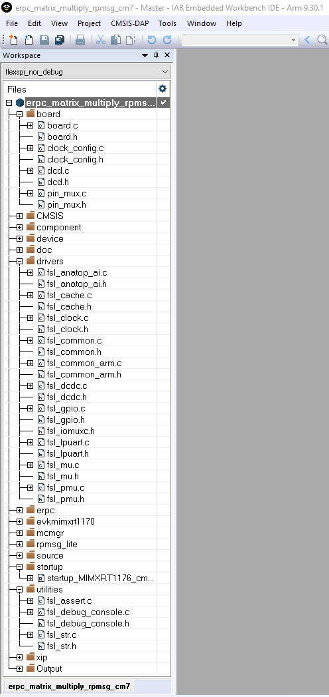

# Client project basic source files

The startup files, board-related settings, peripheral drivers, and utilities belong to the basic project source files and form the skeleton of all MCUXpresso SDK applications. These source files are located in the following folders:

-   *<MCUXpressoSDK\_install\_dir\>/devices/<device\>*
-   *<MCUXpressoSDK\_install\_dir\>/boards/<board\_name\>/multicore\_examples/<example\_name\>/*

|

|

**Parent topic:**[Multicore client application](../topics/multicore_client_application.md)

